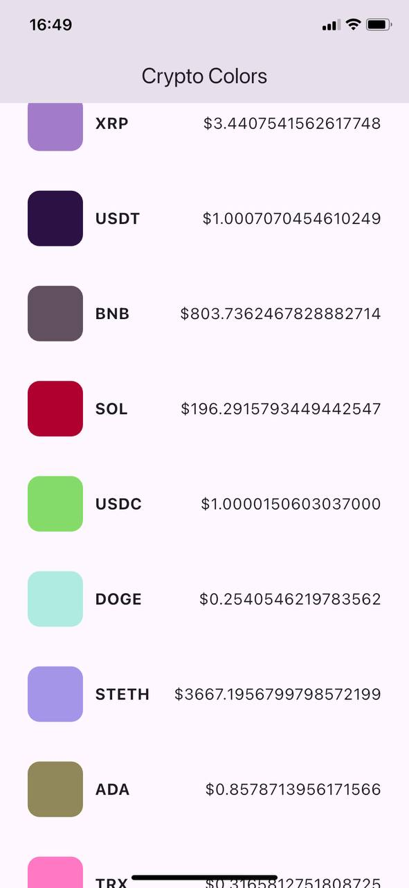

# Archonit test project

## Installation

To set up and run the project locally, follow these steps:

1. **Clone the repository**

   ```sh
   git clone git@github.com:HAYK19978/archonit_test.git
   cd archonit_test
   ```

2. **Install dependencies**

   ```sh
   flutter pub get
   ```

3. **Run the application**
   ```sh
   flutter run
   ```



## 📄 License

This project is licensed under the [MIT License](LICENSE).
